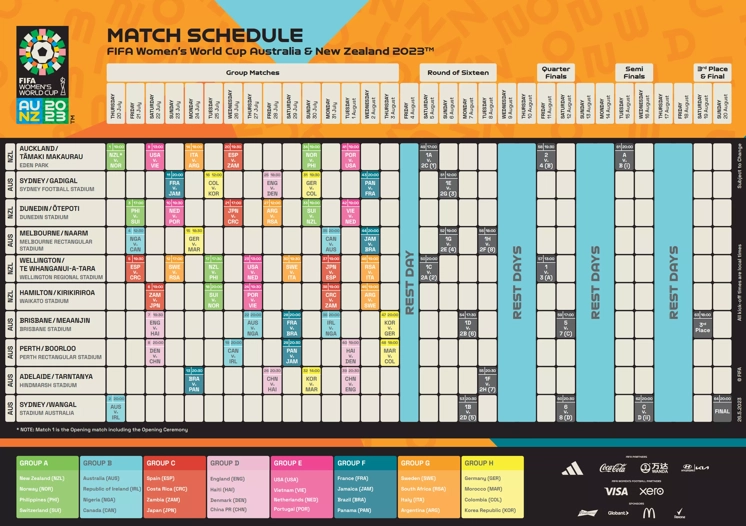
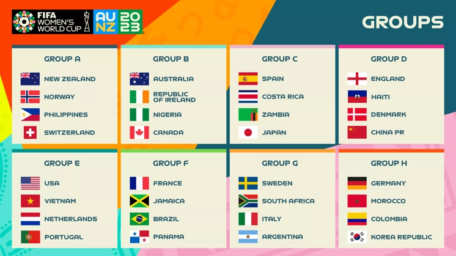
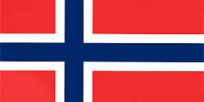

# Trabalho-Autoria-Web
Trabalho usando html no Vscode. O objetivo do trabalho é praticar os conhecimentos passados em aula. O trabalho data-se de criar uma pagina web com as seleções da copa do mundo feminina 2023, onde ao clicar em uma das bandeiras abra outra página com as suas jogadoras convocadas. Em meu trabalho as bandeiras escolhidas foram: Brasil e Colômbia.
<!DOCTYPE html>
<html>
    <head>
         

        <title> Copa do Mundo Feminina 2023 </title>
        
    </head>

    <!-- As bandeiras que abrem outra pagina são as do Brasil e Colombia -->

    <body>
        

            
        

        

        

            <figure>
                <h3> Tabela de Jogos </h3>
                
                <figcaption> Calendário da Copa do Mundo 2023 </figcaption>

                <h3> Tabela de grupos </h3>
                
                <figcaption> Tabela de Grupos Copa do Mundo 2023</figcaption>
            </figure>
        

        

        <h1> Seleções Convocadas </h1>
        
        

            <h2> Grupo A </h2>
             
            
             
            
        

        

            <h2> Grupo B </h2>
            
            
            
            
        

        

            <h2> Grupo C </h2>
            
            
            
            
        

        

            <h2> Grupo D </h2>
            
            
            
            
        

        

            <h2> Grupo E </h2>
            
            
            
            
        

        

            <h2> Grupo F </h2>
            
            
            
            
        

        

            <h2> Grupo G </h2>
            
            
            
            
        

        

            <h2> Grupo H </h2>
            
            
             
            
        

        
    </body>
</html>
